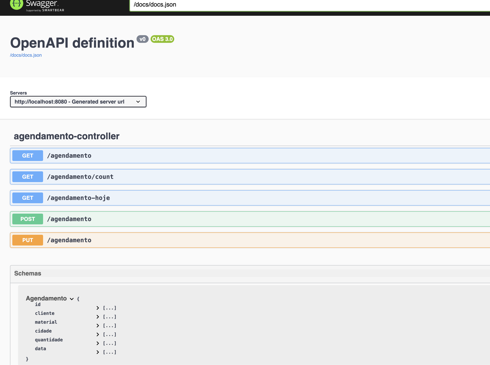
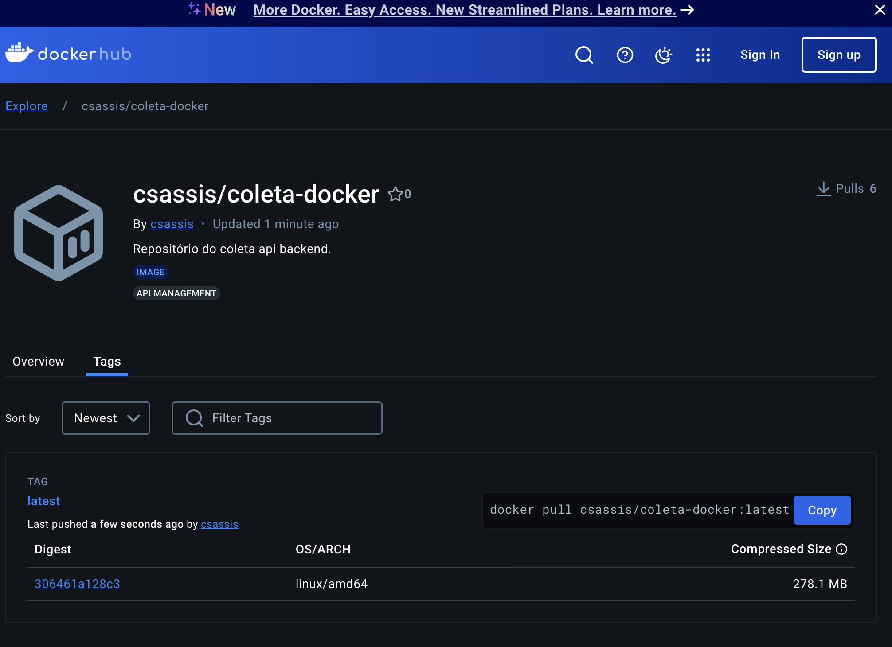
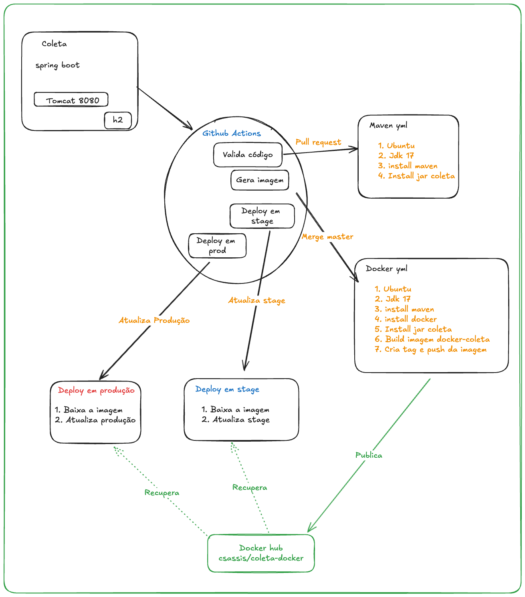
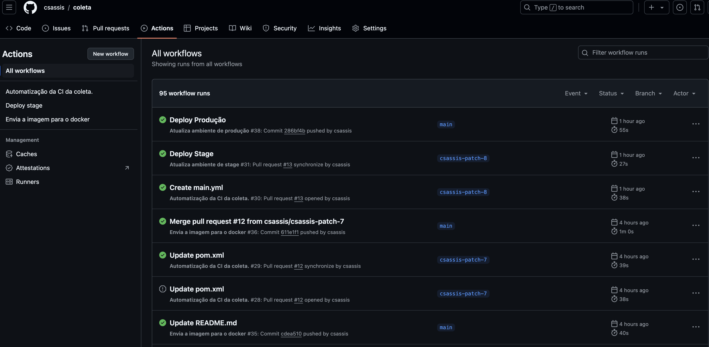
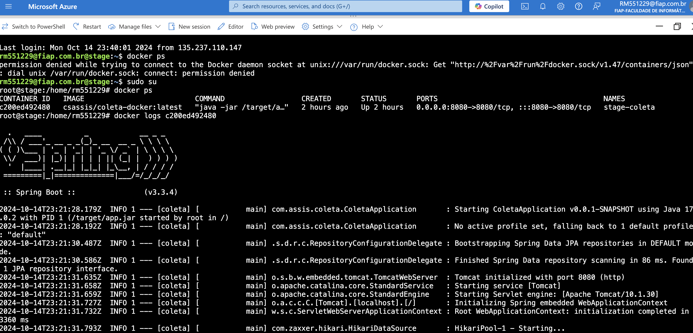
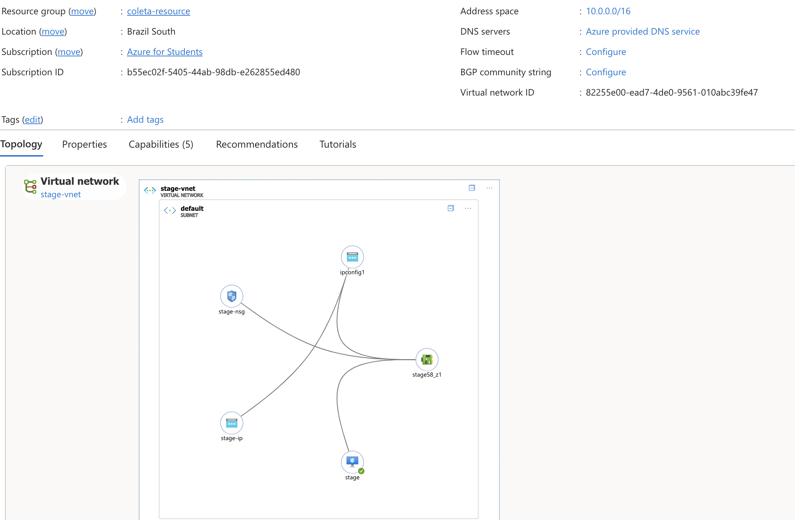
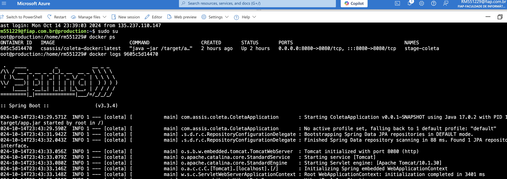
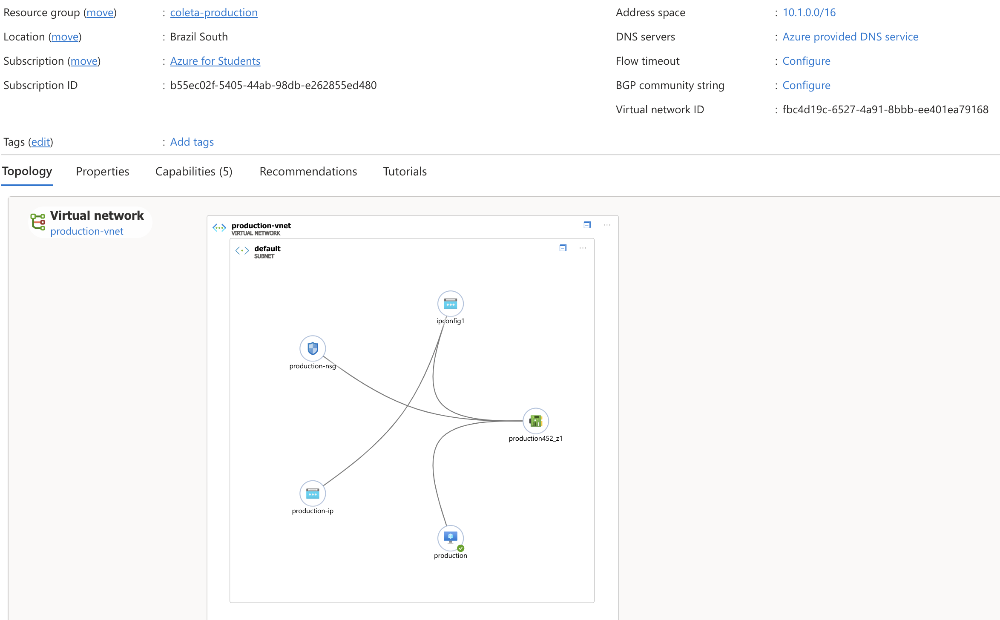

## Coleta Api

Coleta é uma api que disponibiliza o agendamento e a execução de coletas.

______

#### Tecnologia
 - Java 17
 - Spring boot
 - H2
 - Tomcat
 - Github actions
 - Docker
 - Docker hub
 - Rest Api
 - Swagger
 - Open Api

______

#### Use Cases

 - Criação de agendamento
 - Listagem de agendamentos realizados
 - Exclusão ou alteração de um agendamento
 - Agendamentos de hoje

______

#### Usando o projeto

Necessário ter o docker instalado na máquina

```
  docker run -d -p 8080:8080 csassis/coleta-docker:latest
```

#### Documentação das apis

Documentação da Api com Swagger
<p align="center">

## Docker hub
```
FROM openjdk:17-oracle as builder
#WORKDIR build
EXPOSE 8080
RUN mkdir target
ARG JAR_FILE=./target/*.jar
COPY ${JAR_FILE} target/app.jar
ENTRYPOINT ["java","-jar","/target/app.jar"]
```

https://hub.docker.com/repository/docker/csassis/coleta-docker/general

Docker hub
<p align="center">
                   
______


## Fluxo estrutural 

Exemplo do maven.yml (workflow)
```  
name: Automatização da CI da coleta.

on:
  pull_request:
    branches: [ "main" ]

jobs:
  build:

    runs-on: ubuntu-latest

    steps:
    - uses: actions/checkout@v4
    - name: instalacao do java
      uses: actions/setup-java@v4
      with:
        java-version: '17'
        distribution: 'temurin'
        cache: maven
    - name: configuracao das dependecias do projeto usando  Maven
      run: mvn -B package --file pom.xml

    # Optional: Uploads the full dependency graph to GitHub to improve the quality of Dependabot alerts this repository can receive
    - name: atualiza todas dependecias do CI
      uses: advanced-security/maven-dependency-submission-action@571e99aab1055c2e71a1e2309b9691de18d6b7d6
```

Fluxo do CI / CD
<p align="center">

Workflows executados
<p align="center">

______

#### Stage 

Logs da app em Stage
<p align="center">

______

Topologia da app em Stage
<p align="center">

______

#### Production 
Logs da app em Produção
<p align="center">

______

Topologia da app em Produção
<p align="center">

