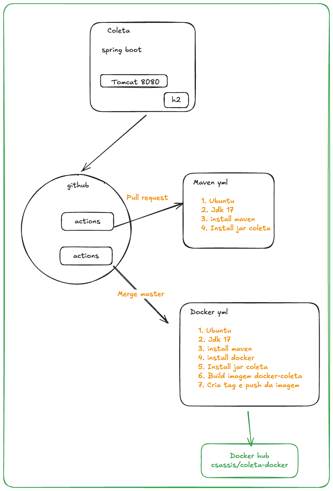
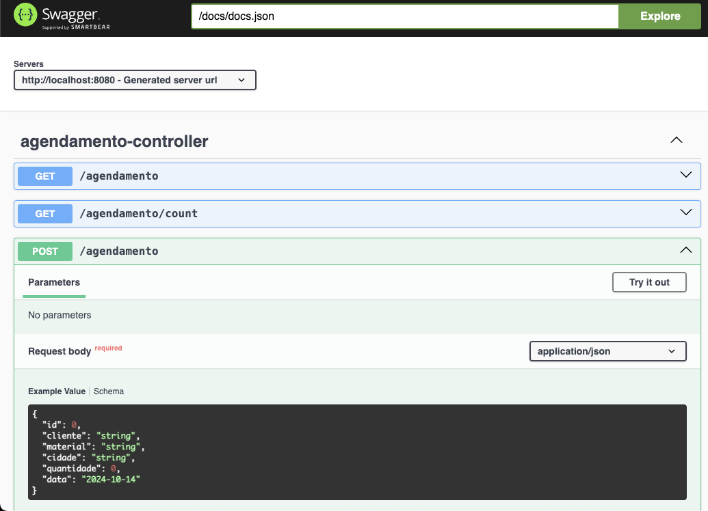

#### coleta
 Coleta é uma api que disponibiliza o agendamento e a execução de coletas.

#### Tecnologia
 - Java 17
 - Spring boot
 - H2
 - Tomcat
 - Github actions
 - Docker
 - Rest Api
 - Swagger
 - Open Api

#### Fluxo estrutural 

#### Use Cases

 - Criação de agendamento
 - Listagem de agendamentos realizados
 - Exclusão ou alteração de um agendamento

